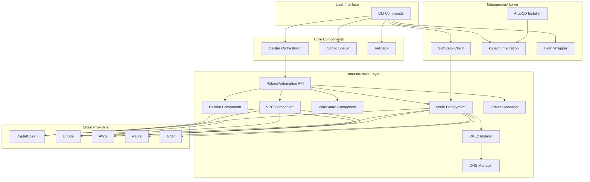
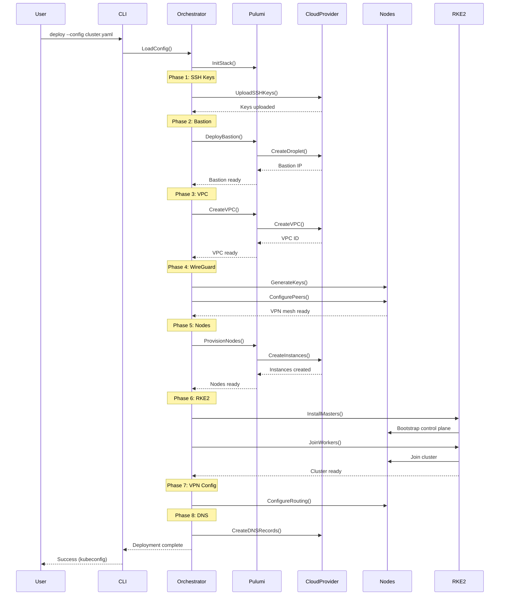

# Architecture

Understanding the internal architecture of **sloth-kubernetes** - how components work together to deliver multi-cloud Kubernetes deployments.

## High-Level Overview



## Component Breakdown

### 1. CLI Layer (`cmd/`)

Entry point for all user interactions.

**Key Files**:
- `cmd/deploy.go` - Cluster deployment
- `cmd/nodes.go` - Node management
- `cmd/stacks.go` - Stack operations
- `cmd/root.go` - Root command and flags

**Responsibilities**:
- Parse command-line arguments
- Load configuration files
- Invoke orchestrator
- Display progress and errors

### 2. Cluster Orchestrator (`internal/orchestrator/cluster_orchestrator.go`)

Core deployment engine that coordinates all components.

**8 Sequential Phases**:

1. **SSH Key Generation** - Create and upload keys to providers
2. **Bastion Deployment** - Deploy secure jump host
3. **VPC Creation** - Create virtual networks
4. **WireGuard Mesh** - Establish encrypted VPN
5. **Node Provisioning** - Deploy master and worker nodes
6. **RKE2 Installation** - Bootstrap Kubernetes
7. **VPN Configuration** - Configure routing
8. **DNS Setup** - Configure DNS records

**Error Handling**:
- Phase rollback on failure
- State preservation for resume
- Detailed error reporting

### 3. Node Deployment (`internal/orchestrator/components/node_deployment.go`)

Multi-cloud node provisioner.

**Capabilities**:
- Cloud-init generation per provider
- SSH key distribution
- Network configuration
- Label and taint application
- Health check integration

**Provider Support**:
```go
type NodeDeployer interface {
    Deploy(pool NodePool) error
    Destroy(nodeName string) error
    Scale(pool string, count int) error
    GetStatus(nodeName string) (NodeStatus, error)
}
```

### 4. Bastion Component (`internal/orchestrator/components/bastion.go`)

Secure access gateway for private clusters.

**Features**:
- Single point of SSH access
- MFA support (Google Authenticator)
- Complete SSH audit logging
- Automatic SSH key forwarding
- Jump host configuration

**Implementation**:
```go
type BastionConfig struct {
    Enabled      bool
    Provider     string
    Size         string
    SSHPort      int
    MFA          bool
    AuditLogging bool
}
```

### 5. WireGuard Mesh (`internal/orchestrator/components/wireguard_mesh.go`)

Encrypted cross-cloud VPN networking.

**Architecture**:
```
┌─────────────┐
│ DO Master   │◄───────┐
│ 10.244.0.10 │        │
└─────────────┘        │
       │               │
       │  WireGuard    │
       │  Tunnel       │
       │               │
       ▼               │
┌─────────────┐  ┌─────────────┐
│ DO Worker   │  │Linode Worker│
│ 10.244.0.11 │  │ 10.244.1.10 │
└─────────────┘  └─────────────┘
```

**Key Generation**:
- Automatic private/public key pairs
- Key distribution via Salt
- Peer discovery and configuration
- NAT traversal with UDP hole-punching

### 6. RKE2 Installer (`internal/orchestrator/components/rke2_installer.go`)

Kubernetes distribution installer.

**Installation Process**:
1. Download RKE2 binary
2. Generate server/agent config
3. Start control plane (masters)
4. Join workers to cluster
5. Configure kubectl access

**Security Hardening**:
- CIS Benchmark compliance
- Pod Security Standards
- RBAC enabled by default
- etcd encryption at rest

### 7. DNS Manager (`internal/orchestrator/components/dns_manager.go`)

Manages DNS records for cluster services.

**Record Types**:
- A records for API server
- A records for ingress
- SRV records for etcd discovery

**Provider Integration**:
- DigitalOcean DNS
- Route53 (AWS)
- Cloud DNS (GCP)
- Azure DNS

### 8. VPC Manager (`internal/orchestrator/components/vpc.go`)

Virtual network provisioning.

**Network Layout**:
```
VPC: 10.244.0.0/16
├── Control Plane Subnet: 10.244.0.0/24
│   ├── master-0: 10.244.0.10
│   ├── master-1: 10.244.0.11
│   └── master-2: 10.244.0.12
│
└── Worker Subnet: 10.244.1.0/24
    ├── worker-0: 10.244.1.10
    ├── worker-1: 10.244.1.11
    └── worker-2: 10.244.1.12
```

### 9. Firewall Manager (`internal/orchestrator/components/firewall.go`)

Security group and firewall rule configuration.

**Default Rules**:
```yaml
Inbound:
  - SSH (22) - From bastion only
  - Kubernetes API (6443) - From allowed sources
  - WireGuard (51820/udp) - From all cluster nodes
  - etcd (2379-2380) - Between masters only
  - Kubelet (10250) - From masters
  
Outbound:
  - All traffic allowed
```

### 10. SaltStack Integration (`pkg/salt/`)

Remote execution and configuration management.

**Architecture**:
```
┌──────────────┐
│ Salt Master  │ (Running on bastion)
│  (Port 4505) │
└──────────────┘
       │
       │ ZeroMQ
       │
       ▼
┌──────────────┐ ┌──────────────┐ ┌──────────────┐
│ Salt Minion  │ │ Salt Minion  │ │ Salt Minion  │
│  (master-0)  │ │  (worker-0)  │ │  (worker-1)  │
└──────────────┘ └──────────────┘ └──────────────┘
```

**100+ Execution Modules**:
- `cmd.run` - Remote command execution
- `pkg.*` - Package management
- `service.*` - Service control
- `grains.*` - System information
- `state.*` - Configuration management

### 11. Configuration System (`pkg/config/`)

YAML-based declarative configuration.

**Type Hierarchy**:
```go
ClusterConfig
├── Metadata
├── Providers
│   ├── DigitalOcean
│   ├── Linode
│   ├── AWS
│   ├── Azure
│   └── GCP
├── Network
│   ├── VPC CIDR
│   ├── Service CIDR
│   ├── Pod CIDR
│   └── WireGuard Config
├── Security
│   ├── Bastion
│   └── Firewall
├── Kubernetes
│   ├── Version
│   ├── Distribution
│   └── RKE2 Config
├── NodePools[]
└── Addons
    ├── ArgoCD
    └── Custom
```

**Validation**:
- Schema validation
- Provider credential checks
- CIDR overlap detection
- Resource quota verification

### 12. Pulumi Automation API (`pkg/pulumi/`)

Infrastructure as Code without external CLI.

**Embedded Components**:
- Pulumi engine
- Provider plugins (DO, Linode, AWS, etc.)
- State management
- Update preview and apply

**Stack Management**:
```go
type StackManager interface {
    Create(name string) error
    Select(name string) error
    Destroy(name string) error
    List() ([]Stack, error)
    Export() (json.RawMessage, error)
    Import(state json.RawMessage) error
}
```

## Deployment Workflow

### Complete Deployment Sequence



## State Management

### Pulumi State

**Local Backend** (default):
```
~/.pulumi/
└── stacks/
    ├── production/
    │   └── .pulumi/
    │       └── stack.json
    └── staging/
        └── .pulumi/
            └── stack.json
```

**Remote Backends** (optional):
- S3
- Azure Blob Storage
- Google Cloud Storage
- Pulumi Cloud Service

### Stack Isolation

Each cluster = one Pulumi stack:
```bash
# List stacks
sloth-kubernetes stacks list

# Output:
production   (active)
staging
development
```

## Security Architecture

### Network Isolation

```
┌─────────────────────────────────────┐
│          Public Internet            │
└─────────────┬───────────────────────┘
              │
              │ SSH (22)
              │ API Server (6443)
              ▼
    ┌────────────────┐
    │ Bastion Host   │
    │ Public IP      │
    └────────┬───────┘
             │ SSH Jump
             │
    ┌────────▼────────────────────┐
    │   Private VPC Network       │
    │   10.244.0.0/16             │
    │                             │
    │  ┌────────────────────────┐ │
    │  │  Master Nodes          │ │
    │  │  Private IPs only      │ │
    │  │  10.244.0.x            │ │
    │  └────────────────────────┘ │
    │                             │
    │  ┌────────────────────────┐ │
    │  │  Worker Nodes          │ │
    │  │  Private IPs only      │ │
    │  │  10.244.1.x            │ │
    │  └────────────────────────┘ │
    │                             │
    │  WireGuard encrypted mesh   │
    └─────────────────────────────┘
```

## Performance Characteristics

### Deployment Times

- Single node cluster: ~3 minutes
- 3 master + 5 worker cluster: ~5-7 minutes
- Multi-cloud cluster: ~8-10 minutes
- With ArgoCD: +2 minutes

### Resource Usage

**Binary Size**: ~50MB (includes Pulumi + kubectl)

**Memory**:
- CLI operations: ~100MB
- Deployment: ~500MB-1GB (Pulumi engine)

**Network**:
- Initial deployment: ~500MB download (RKE2, containers)
- WireGuard overhead: <1% bandwidth

## Extensibility

### Adding Cloud Providers

Implement the `CloudProvider` interface:

```go
type CloudProvider interface {
    CreateVPC(cidr string) (string, error)
    CreateInstance(config NodeConfig) (Instance, error)
    DestroyInstance(id string) error
    UploadSSHKey(publicKey string) error
}
```

### Custom Components

Add to orchestrator phases:

```go
func (o *Orchestrator) Deploy() error {
    phases := []Phase{
        o.sshKeys,
        o.bastion,
        o.vpc,
        o.wireguard,
        o.nodes,
        o.rke2,
        o.vpnConfig,
        o.dns,
        // Add custom phase here
        o.customComponent,
    }
    
    return o.executePhases(phases)
}
```

## Next Steps

- **[User Guide](../user-guide/index.md)** - Learn commands
- **[FAQ](../faq.md)** - Common questions
