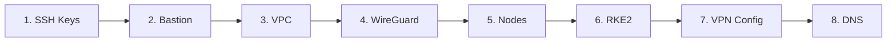

# Quick Start

Deploy a production-grade Kubernetes cluster in **under 5 minutes**. This guide walks you through creating a simple single-provider cluster on DigitalOcean.

## Prerequisites

Before starting, ensure you have:

- [x] sloth-kubernetes installed ([Installation Guide](installation.md))
- [x] DigitalOcean account with API token ([Get token](https://cloud.digitalocean.com/account/api/tokens))
- [x] SSH key pair (`ssh-keygen -t ed25519 -f ~/.ssh/sloth-k8s`)

## Step 1: Set Cloud Provider Token

```bash
export DO_TOKEN="your-digitalocean-token-here"
```

!!! tip "Persist Token"
    Add to `~/.bashrc` or `~/.zshrc` to persist across sessions:
    ```bash
    echo 'export DO_TOKEN="your-token"' >> ~/.bashrc
    ```

## Step 2: Create Cluster Configuration

Create a file named `cluster.yaml`:

```yaml title="cluster.yaml"
metadata:
  name: my-first-cluster
  region: nyc3

providers:
  digitalocean:
    enabled: true
    token: ${DO_TOKEN}
    region: nyc3

network:
  vpcCIDR: 10.244.0.0/16
  serviceCIDR: 10.96.0.0/12
  podCIDR: 10.100.0.0/16

security:
  bastion:
    enabled: true
    provider: digitalocean
    size: s-1vcpu-1gb

kubernetes:
  version: "v1.28.2+rke2r1"
  distribution: rke2

nodePools:
  - name: masters
    provider: digitalocean
    role: master
    count: 1
    size: s-2vcpu-4gb
    region: nyc3

  - name: workers
    provider: digitalocean
    role: worker
    count: 2
    size: s-2vcpu-4gb
    region: nyc3
```

## Step 3: Validate Configuration

Before deploying, validate your configuration:

```bash
sloth-kubernetes validate --config cluster.yaml
```

Expected output:

```
✓ Configuration validated successfully
✓ Provider credentials verified (DigitalOcean)
✓ Node pool configuration valid
✓ Network configuration valid
✓ Bastion configuration valid
```

## Step 4: Deploy Cluster

Deploy the cluster with automatic orchestration:

```bash
sloth-kubernetes deploy --config cluster.yaml
```

The deployment follows 8 phases:



Progress output:

```
🚀 Starting deployment: my-first-cluster
📋 Phase 1/8: Generating SSH keys...
✓ SSH keys generated and uploaded to DigitalOcean

🏗️  Phase 2/8: Deploying bastion host...
✓ Bastion deployed at 164.90.xxx.xxx

🌐 Phase 3/8: Creating VPC...
✓ VPC created: 10.244.0.0/16

🔐 Phase 4/8: Configuring WireGuard mesh...
✓ WireGuard mesh configured (4 nodes)

⚙️  Phase 5/8: Provisioning nodes...
✓ Masters: 1/1 ready
✓ Workers: 2/2 ready

☸️  Phase 6/8: Installing RKE2...
✓ Control plane initialized
✓ Workers joined cluster

🔗 Phase 7/8: Configuring VPN routing...
✓ VPN routing configured

📝 Phase 8/8: Setting up DNS...
✓ DNS records created

✅ Deployment complete! (4m 32s)
```

## Step 5: Access Your Cluster

### Get Kubeconfig

```bash
# Export kubeconfig
sloth-kubernetes kubeconfig > ~/.kube/my-first-cluster.kubeconfig

# Set as active context
export KUBECONFIG=~/.kube/my-first-cluster.kubeconfig

# Or use embedded kubectl
sloth-kubernetes kubectl get nodes
```

### Verify Cluster

```bash
# Check nodes
sloth-kubernetes kubectl get nodes

# Output:
NAME                     STATUS   ROLES                       AGE   VERSION
my-first-cluster-master-0   Ready    control-plane,etcd,master   5m    v1.28.2+rke2r1
my-first-cluster-worker-0   Ready    <none>                      4m    v1.28.2+rke2r1
my-first-cluster-worker-1   Ready    <none>                      4m    v1.28.2+rke2r1

# Check cluster info
sloth-kubernetes kubectl cluster-info

# Deploy test workload
sloth-kubernetes kubectl create deployment nginx --image=nginx
sloth-kubernetes kubectl expose deployment nginx --port=80 --type=LoadBalancer
```

## Step 6: SSH to Nodes

Access nodes through the bastion host:

```bash
# List nodes
sloth-kubernetes nodes list

# Output:
NAME                       ROLE     PROVIDER        IP              STATUS
my-first-cluster-master-0  master   digitalocean    10.244.0.10     ready
my-first-cluster-worker-0  worker   digitalocean    10.244.0.11     ready
my-first-cluster-worker-1  worker   digitalocean    10.244.0.12     ready

# SSH to a node (automatically via bastion)
sloth-kubernetes nodes ssh my-first-cluster-master-0
```

## Step 7: Manage with SaltStack

Use SaltStack for remote operations:

```bash
# Test connectivity
sloth-kubernetes salt ping

# Get system info
sloth-kubernetes salt grains.items

# Run commands
sloth-kubernetes salt cmd.run "kubectl get nodes"

# Install packages
sloth-kubernetes salt pkg.install htop

# Restart services
sloth-kubernetes salt service.restart kubelet
```

## Step 8: Cleanup

When done testing, destroy the cluster:

```bash
# Destroy all resources
sloth-kubernetes destroy --config cluster.yaml

# Confirm destruction
# Type 'yes' when prompted
```

## What's Next?

Congratulations! You've deployed your first Kubernetes cluster. Now explore:

### Multi-Cloud Deployment

Deploy across multiple providers for high availability:

```yaml
providers:
  digitalocean:
    enabled: true
    token: ${DO_TOKEN}
  linode:
    enabled: true
    token: ${LINODE_TOKEN}

nodePools:
  - name: do-masters
    provider: digitalocean
    role: master
    count: 1

  - name: linode-masters
    provider: linode
    role: master
    count: 2

  - name: workers
    provider: digitalocean
    role: worker
    count: 3
```

### Enable GitOps with ArgoCD

```yaml
addons:
  argocd:
    enabled: true
    version: "v2.9.0"
    repository: "https://github.com/your-org/k8s-addons"
    path: "clusters/production"
```

### Advanced Features

- **[User Guide](../user-guide/index.md)** - Complete CLI reference
- **[Architecture](../architecture/index.md)** - Deep dive into components
- **[Configuration Reference](../user-guide/index.md)** - All YAML options

## Troubleshooting

### Deployment Fails at Node Provisioning

```bash
# Check Pulumi logs
sloth-kubernetes status

# Verify cloud provider credentials
sloth-kubernetes login digitalocean

# Check available regions
curl -H "Authorization: Bearer $DO_TOKEN" \
  "https://api.digitalocean.com/v2/regions"
```

### Cannot Access Cluster

```bash
# Verify kubeconfig
sloth-kubernetes kubeconfig

# Test bastion connectivity
sloth-kubernetes nodes list

# Check firewall rules
sloth-kubernetes status
```

### Nodes Not Joining

```bash
# SSH to master and check RKE2
sloth-kubernetes nodes ssh my-first-cluster-master-0
sudo systemctl status rke2-server

# Check worker node
sloth-kubernetes nodes ssh my-first-cluster-worker-0
sudo systemctl status rke2-agent

# View RKE2 logs
sudo journalctl -u rke2-server -f
```

## Common Commands Cheat Sheet

```bash
# Cluster Management
sloth-kubernetes deploy --config cluster.yaml
sloth-kubernetes destroy --config cluster.yaml
sloth-kubernetes status
sloth-kubernetes validate --config cluster.yaml

# Node Operations
sloth-kubernetes nodes list
sloth-kubernetes nodes ssh <name>
sloth-kubernetes nodes add --pool workers --count 2
sloth-kubernetes nodes drain <name>

# Kubernetes
sloth-kubernetes kubeconfig
sloth-kubernetes kubectl get nodes
sloth-kubernetes kubectl get pods -A
sloth-kubernetes kubectl apply -f manifest.yaml

# SaltStack
sloth-kubernetes salt ping
sloth-kubernetes salt cmd.run "uptime"
sloth-kubernetes salt pkg.install <package>
sloth-kubernetes salt service.restart <service>

# Stacks (Multiple Clusters)
sloth-kubernetes stacks list
sloth-kubernetes stacks select <name>
sloth-kubernetes stacks info
```

## Next Steps

Ready to build production clusters? Continue with:

- **[User Guide](../user-guide/index.md)** - Learn all 50+ commands
- **[Architecture Guide](../architecture/index.md)** - Understand the internals
- **[Examples](../user-guide/index.md)** - Production-ready configurations
